# Muhammad Muzammil — Full-Stack Web Developer (MERN Stack) in Karachi, Pakistan

## About Muhammad Muzammil

I'm **Muhammad Muzammil**, a **Full-Stack Web Developer** and BSCS student at **KIET (Karachi Institute of Economics & Technology)** in **Karachi, Pakistan**. I build web applications end to end with the **MERN stack** (MongoDB, Express.js, React.js, Node.js), **Supabase**, **Firebase** and **WordPress** — from REST APIs and authentication to responsive React and vanilla-JavaScript frontends. I'm currently a **Full Stack Developer Intern at NexSoft Solutions** and I'm open to collaborations, internships and freelance projects.

- **1st place** — CODE JUNG 2025 (Web Development) · **Top 5** — SMIT Hackathon 2025 · **Cisco** Networking Basics certified
- Looking for a **MERN stack developer in Karachi**, a **React developer in Pakistan**, or a **WordPress developer**? [Get in touch](mailto:muzammil.muhammad7782@gmail.com).

## Featured projects

| Project | What it does | Tech | Link |
|---|---|---|---|
| **NoteStack** | Sticky-notes SaaS with glassmorphism auth and pastel dashboard | Supabase, JavaScript | [repo](https://github.com/MuhammadMuzammil-TheDeveloper?tab=repositories) |
| **Asset Maintenance System** | QR-based asset tracking with Admin / Technician / Public roles | Supabase, vanilla JS | [repo](https://github.com/MuhammadMuzammil-TheDeveloper?tab=repositories) |
| **CareerFlow** | Full-stack job management platform with auth and profiles | Node.js, Express, MongoDB | [repo](https://github.com/MuhammadMuzammil-TheDeveloper?tab=repositories) |
| **DonorHub** | Blood emergency web app connecting donors with patients in real time | Web app | [repo](https://github.com/MuhammadMuzammil-TheDeveloper?tab=repositories) |
| **Trimly** | Salon booking and management mobile app (team project) | React Native, Node.js, Express, MongoDB Atlas, n8n | [repo](https://github.com/MuhammadMuzammil-TheDeveloper?tab=repositories) |
| **Mini Marketplace** | Marketplace with JWT auth and Cloudinary image uploads | Node.js, Express, MongoDB | [repo](https://github.com/MuhammadMuzammil-TheDeveloper?tab=repositories) |
| **Full-Stack Todo App** | React/Vite frontend with auth and dashboard | React, Vite, Node.js | [repo](https://github.com/MuhammadMuzammil-TheDeveloper?tab=repositories) |
| **AI Quiz Platform** | Quiz app wired to the Open Trivia DB API | JavaScript | [Live demo](https://quizapplicationmuzammil.netlify.app) |
| **WorldAtlas** | Country and geo data explorer | Vanilla JavaScript | [Live demo](https://worldatlas-website.netlify.app) |
| **SMIT UI Clone** | Pixel-level clone of the SMIT website | HTML, CSS | [Live demo](https://smitwebsiteclone.netlify.app) |
| **Hospital Management System** | Patient, staff and records management | Full-stack | [repo](https://github.com/MuhammadMuzammil-TheDeveloper?tab=repositories) |
| **Supabase Storage CRUD App** | File storage CRUD with Supabase | Supabase, JavaScript | [repo](https://github.com/MuhammadMuzammil-TheDeveloper?tab=repositories) |
| **Rain Detector & Door Rat Alert** | Arduino/IoT alert systems (sensors, buzzer, LCD) | Arduino, Wokwi | [repo](https://github.com/MuhammadMuzammil-TheDeveloper?tab=repositories) |

## FAQ

**Who is Muhammad Muzammil?** A Full-Stack Web Developer (MERN) and BSCS student at KIET Karachi, Pakistan, currently interning at NexSoft Solutions.

**What does he work with?** JavaScript (ES6+), React.js, Node.js, Express.js, MongoDB, Supabase, Firebase, PostgreSQL, MySQL, Tailwind CSS, WordPress and Elementor.

**Is he available for work?** Yes — open to internships, collaborations and freelance web development projects from Karachi, Pakistan.

