**Muhammad Muzammil** is a Full-Stack Web Developer (MERN) in Karachi, Pakistan — BSCS at KIET (grad. 2027), Full Stack Developer Intern at NexSoft Solutions. Open to freelance work and internships.

**Live demos:** [AI Quiz Platform](https://quizapplicationmuzammil.netlify.app) · [WorldAtlas](https://worldatlas-website.netlify.app) · [SMIT UI Clone](https://smitwebsiteclone.netlify.app) · [All repositories](https://github.com/MuhammadMuzammil-TheDeveloper?tab=repositories)

**Connect:** [GitHub](https://github.com/MuhammadMuzammil-TheDeveloper) · [LinkedIn](https://linkedin.com/in/muhammad-muzammil-7562bb316) · [Email](mailto:muzammil.muhammad7782@gmail.com)
