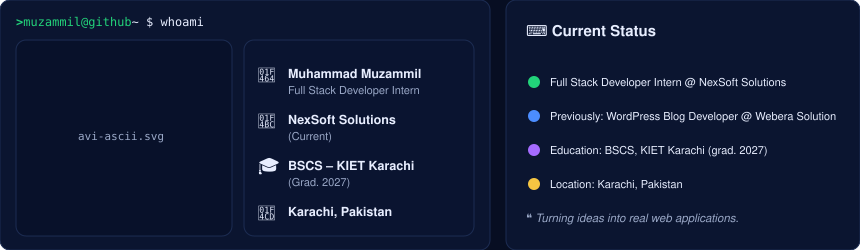
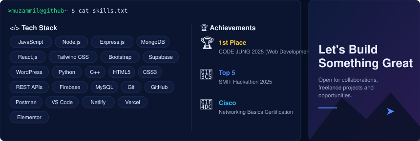
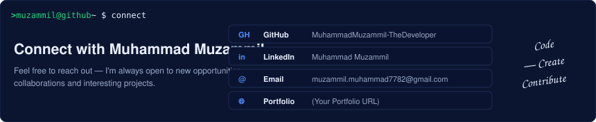

 

 

<h3><code>muzammil@github ~ $ ./contributions.sh</code></h3>

 

| Project | Live |
|---|---|
| **NoteStack** | [NEEDS USER URL] |
| **Asset Maintenance System** | [NEEDS USER URL] |
| **AI Quiz Platform** | [Live demo](https://quizapplicationmuzammil.netlify.app) |
| **WorldAtlas** | [Live demo](https://worldatlas-website.netlify.app) |
| **Hospital Management System** | [NEEDS USER URL] |
| **SMIT UI Clone** | [Live demo](https://smitwebsiteclone.netlify.app) |

More on [my GitHub](https://github.com/MuhammadMuzammil-TheDeveloper?tab=repositories) and [my portfolio](#) `[NEEDS USER URL]`.

 

 

